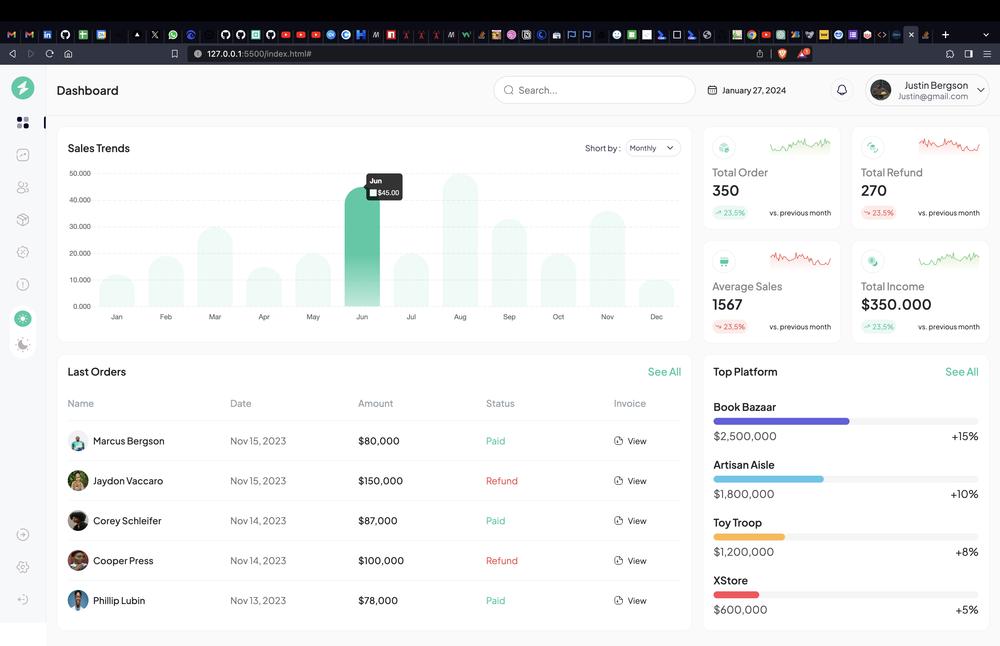

# Geegpay Design and Front-End Challenge: Unleash Your Creativity

## Task: Analytics Dashboard

I participated in this wonderful hackathon by [Geegpay](https://twitter.com/geegpay_hq) x [David Herbert](https://twitter.com/DaveyHert) to produce a pixel-perfect code of the given challenge figma file. I am happy to have gained alot of additional knowledge while building this Analytics Dashboard.

Given figma design:

## My Goals:

* To produce a pixel-perfect result of the given design
* Make it responsive to screens
* Make it accessible to screen readers
* Able to switch between theme colors
* Submit before deadline and use relavant hash tags

## Goals Status:

I achieved all the goals listed above and more.

I was supper exiting using relative units where necessary for responsivity with the aid of a tool I built recently; [iConvertUnits](https://iconvertunits.vercel.app/).

## A quick glance at the pixel-perfect code of mine

Desktop view (light theme):

Desktop view (Dark theme):

Mobile view (light theme):

Mobile view (dark theme):

Mobile view menu open:

